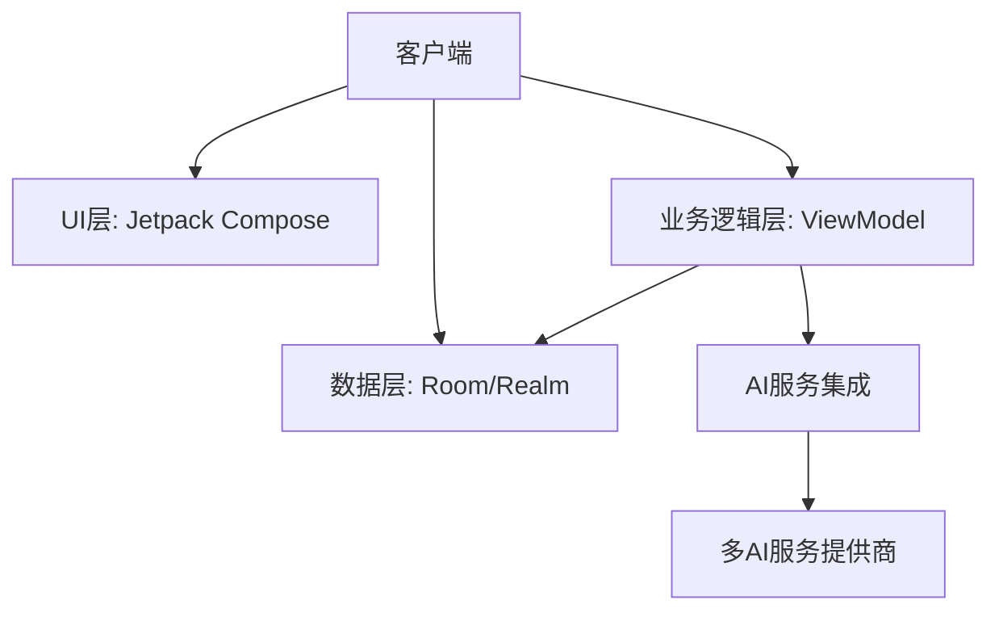

# AIGroupApp 技术架构文档

## 1. 系统架构概述



- **分层架构**：清晰的UI-业务逻辑-数据三层分离
- **模块化设计**：功能模块高度解耦
- **响应式数据流**：基于Kotlin Flow的状态管理

## 2. 核心技术栈

| 技术领域       | 技术选型                          |
|----------------|-----------------------------------|
| 开发语言       | Kotlin 1.9+                      |
| UI框架         | Jetpack Compose + Material 3      |
| 架构模式       | MVVM + Clean Architecture        |
| 异步处理       | Kotlin Coroutines + Flow         |
| 依赖注入       | Dagger Hilt                      |
| 本地存储       | Realm DB + DataStore             |
| 网络通信       | Ktor Client + gRPC               |
| 构建工具       | Gradle (Kotlin DSL)              |

## 3. 模块划分

### 3.1 核心功能模块

1. **用户认证模块**
   - OAuth2.0集成
   - 生物识别认证
   - 会话管理

2. **AI对话模块**
   - 多模型对话引擎
   - 上下文管理
   - 流式响应处理

3. **知识管理模块**
   - 文档解析(PDF/Word)
   - 向量数据库存储
   - 语义搜索

4. **多媒体处理模块**
   - 图片/视频处理流水线
   - 相机集成
   - 内容压缩优化

### 3.2 基础服务模块

1. **网络服务**
   - 多服务商API适配层
   - 统一错误处理
   - 重试机制

2. **数据持久化**
   - Realm数据库管理
   - Preferences数据存储
   - 文件系统管理

3. **工具模块**
   - 扩展函数库
   - 通用UI组件
   - 测试工具集

## 4. 数据流设计

### 4.1 核心数据流

1. **用户请求处理流程**:
   ```
   UI事件 -> ViewModel -> UseCase -> Repository 
   -> DataSource -> 网络/本地 -> 响应回调
   ```

2. **AI对话数据流**:
   ```
   用户输入 -> 协议转换 -> AI服务端点 -> 流式响应 
   -> 数据解析 -> UI渲染
   ```

3. **数据同步流程**:
   ```
   云端变更 -> Webhook通知 -> 增量同步 
   -> 本地数据库更新 -> UI刷新
   ```

### 4.2 状态管理

- 使用`MutableStateFlow`管理UI状态
- 单向数据流设计
- 状态持久化策略

## 5. 部署架构

### 5.1 客户端部署

- **打包方式**：APK/AAB
- **渠道分发**：Google Play/企业分发
- **更新策略**：增量更新+热修复

### 5.2 服务依赖

1. **AI服务端点**:
   - OpenAI
   - Anthropic Claude  
   - Google Gemini
   - 百度文心
   - 阿里通义

2. **基础服务**:
   - Firebase服务套件
   - 自有BFF服务层
   - 内容分发网络

## 6. 关键技术实现

### 6.1 多AI服务集成

- 统一接口设计(`ChatEndpoint`)
- 协议适配层
- 服务商枚举管理

### 6.2 性能优化

1. **数据库优化**:
   - Realm索引策略
   - 批量写入
   - 惰性加载

2. **UI性能**:
   - Compose重组优化
   - 列表懒加载
   - 图片缓存

### 6.3 安全机制

- 数据加密(Android Keystore)
- 证书绑定
- 权限最小化