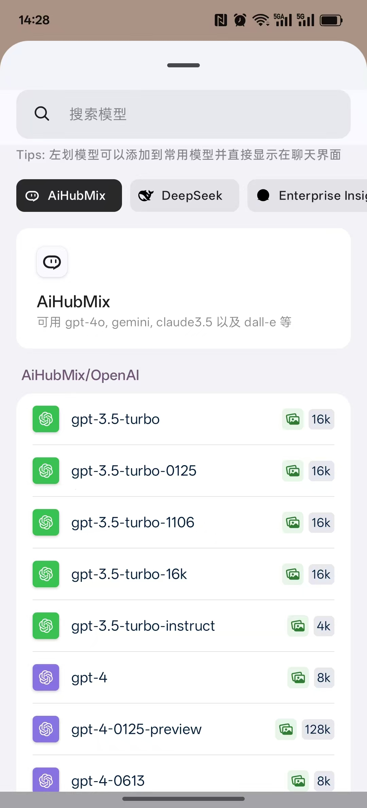
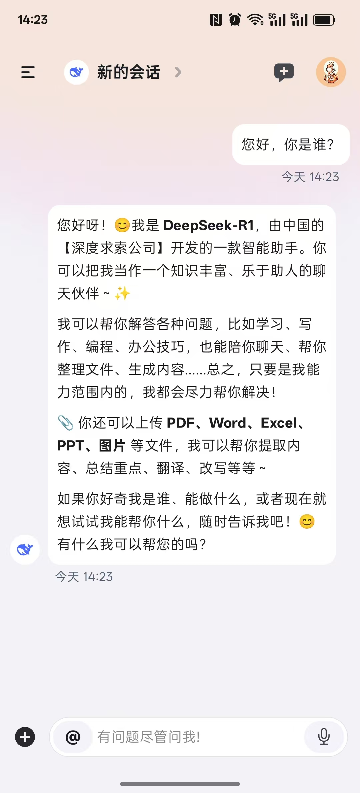
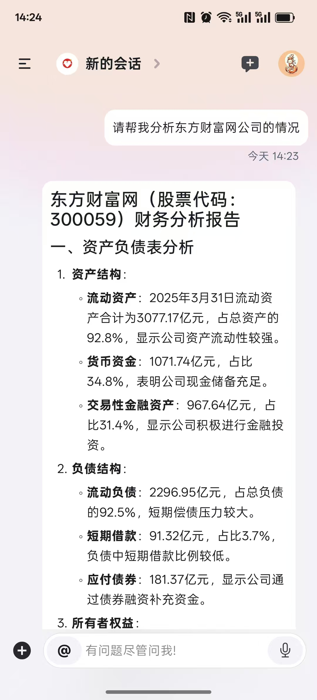
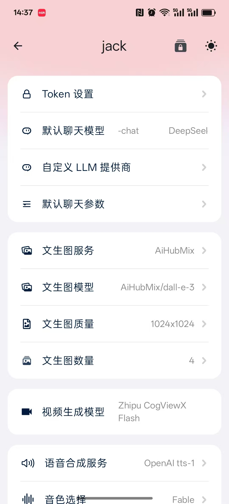

# 🚀 AI Group 移动应用 - 您的智能助手平台

[English](readme.md) | **简体中文**

[](https://github.com/jackdark425/aigroupapp/releases)
[](https://github.com/jackdark425/aigroupapp/stargazers)
 


🔗 **项目地址**: [https://github.com/jackdark425/aigroupapp](https://github.com/jackdark425/aigroupapp)

AI Group 是一款功能强大的移动端智能助手应用，集成了多种大语言模型(LLM)和AI服务，为您提供便捷的智能交互体验。

## ✨ 核心功能

- 🤖 **多模型集成** - 支持OpenAI、Claude、Gemini等主流LLM，以及国产大模型(文心一言、通义千问等)
- 🔌 **自定义服务** - 可添加和管理自定义LLM API端点(CustomLLMProvider)
- 🎨 **主题定制** - 提供丰富的UI主题和个性化设置选项
- 📱 **移动优化** - 专为移动设备设计的流畅交互体验
- 🔒 **隐私保护** - 本地数据加密和安全API通信

## 🛠️ 安装与使用

1. 克隆本仓库：
   ```bash
   git clone https://github.com/jackdark425/aigroupapp.git
   ```
2. 使用Android Studio打开项目
3. 配置gradle.properties中的必要参数
4. 连接Android设备或启动模拟器
5. 点击运行按钮部署应用

## 📸 应用截图

<div align="center">

<table>
  <tr>
    <td align="center" width="50%">
      <h4>🏠 模型选择界面</h4>
      
    </td>
    <td align="center" width="50%">
      <h4>🤖 聊天界面</h4>
      
    </td>
  </tr>
  <tr>
    <td align="center" width="50%">
      <h4>💬 自定义助手聊天界面</h4>
      
    </td>
    <td align="center" width="50%">
      <h4>⚙️ 设置界面</h4>
      
    </td>
  </tr>
</table>

</div>

## 🤝 贡献指南

我们欢迎各种形式的贡献！请遵循以下步骤：

1. Fork本仓库
2. 创建您的功能分支 (`git checkout -b feature/AmazingFeature`)
3. 提交您的更改 (`git commit -m 'Add some AmazingFeature'`)
4. 推送到分支 (`git push origin feature/AmazingFeature`)
5. 发起Pull Request

## ⭐ 支持我们

如果这个项目对您有帮助，请给我们一个star！您的支持是我们持续改进的动力。

```markdown
[](https://star-history.com/#jackdark425/aigroupapp)
```

## 📜 许可证

本项目采用MIT许可证 - 详情请参阅[LICENSE](LICENSE)文件